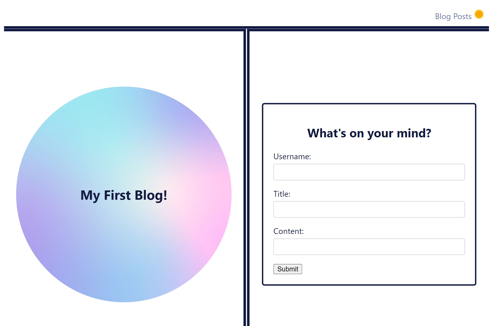
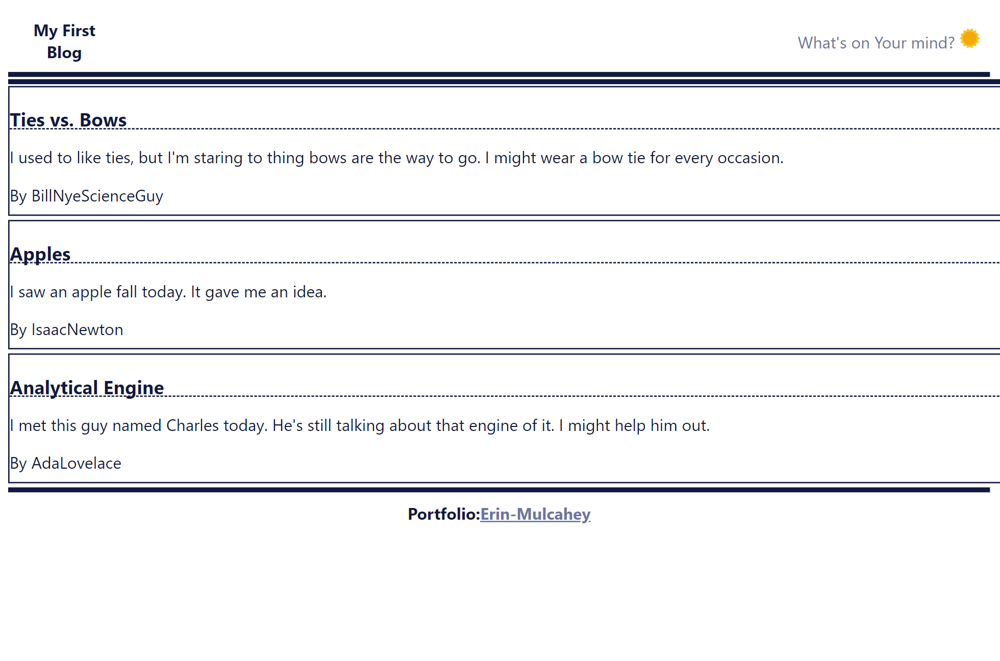

# Personal-Blog-Erin-Mulcahey

## Description

I created a two-page website where users will input and view blog posts. It includes building a content form, dynamically rendering blog posts, and implementing a light/dark mode toggle. My motivation was to create a way to keep track of thoughts and ideas with an internet based format. This website solved the problem of needing to hand write things you want to keep track of. I learned how to create and connect a multip-page web page, create a form that takes information in and put the information onto another page for the user to see. 
Application URL: https://emulcahey.github.io/Personal-Blog-Erin-Mulcahey/

## Installation

N/A

## Usage

On the first page of the personal blog there is a form to add information. The sections of the form include username, title, and content. The user can write what they'd like in each section then click submit. if one or more of the tree fields is/are empty, then there will be a notification that one or more fields needs to be completed before submission. Once submit is clicked, the user is automatically brought to the blog page. The blog page will have they entry posted on the page. The blog page will list all the entries that have been created. This website uses local storage to keep track of all the blog posts. On the upper right of both pages there is a sun logo. When the logo is pressed, it will toggle light/dark mode. The 'Blog Posts' link on the main page will bring the user to the blog page. The 'What's on Your mind?' button will bring the user back to the main form bage so they can create another blog post.

## Credits

N/A

## License

MIT License.
